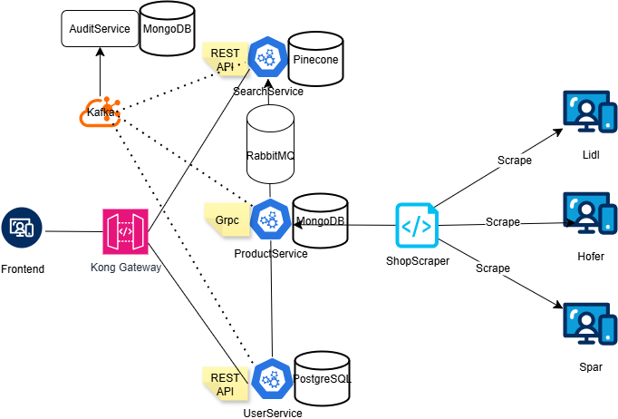
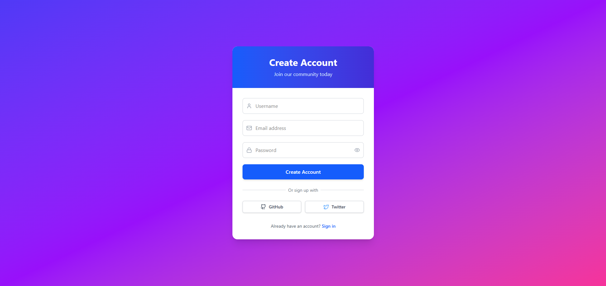
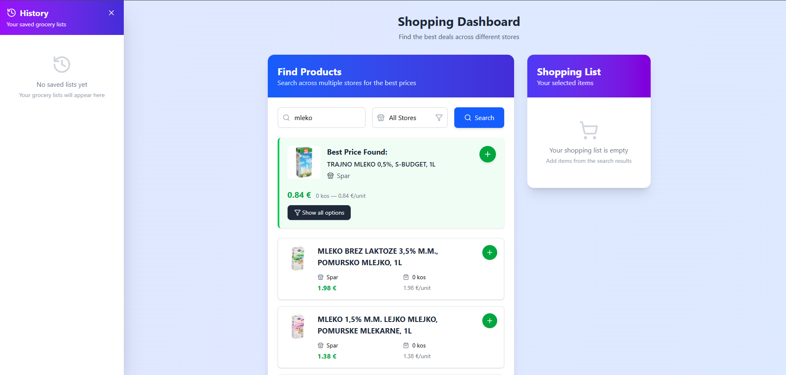
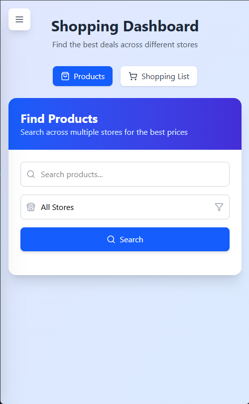
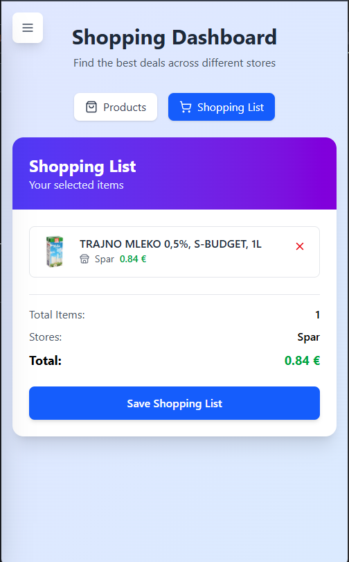

# 🛒 SmartShopperApp

SmartShopperApp is an intelligent shopping app built to help users in **Slovenia** find the **cheapest products across multiple stores**. Using modern technologies and AI-based semantic search, the app makes shopping smarter, faster, and more affordable.

---

## 🚀 Features

- 🧬 **AI-Driven Semantic Search** using state-of-the-art models for the Slovenian language
- 🔍 **Search & Filter Products** from various Slovenian retailers
- 🛍️ **Best Deals Discovery** across stores and brands
- 🧾 **Shopping List Management** with real-time pricing
- 📊 **Grocery List History** tracking for budgeting
- 📦 **Automated Product Updates** via scraping and message queues
- 🛡️ **Centralized Audit Logging** for all system actions

---

## 🧠 System Architecture

The application is built on a microservice-based architecture, making it scalable, maintainable, and production-ready.



### 🧩 Microservices Overview

| Service           | Language | DB/Protocol         | Description |
|------------------|----------|---------------------|-------------|
| **ProductService** | Go       | MongoDB + gRPC      | Stores product data and communicates with RabbitMQ to forward new product data. |
| **UserService**    | C# (.NET) | PostgreSQL + REST   | Handles user authentication, shopping list creation, and history tracking. |
| **SearchService**  | Python   | Pinecone + REST     | Generates product embeddings and performs semantic search. |
| **ShopScraper**    | Python   | -                   | Scrapes store websites, formats product data, and pushes it to ProductService. |
| **AuditService**   | Go       | MongoDB + Kafka     | Central logging system capturing user and system activities. |

---

## 🖥️ Frontend Options

SmartShopperApp supports two frontend architectures:

- **Micro Frontends**:
  - `shell`: main container
  - `mfe-user`: user auth, lists, history
  - `mfe-search`: search UI
- **Vite + React App**:
  - All features in one app

---

## 🔐 Authentication Screens

| Login | Register |
|-------|----------|
|  |  |

---

## 📊 Dashboard Views

| Large Screen | Small Screen |
|--------------|--------------|
|  | <br> |

---

## 🧱 Tech Stack

- **Languages**: Go, Python, C#, JavaScript (React)
- **Databases**: MongoDB, PostgreSQL, Pinecone (vector DB)
- **Protocols**: gRPC, REST, Kafka, RabbitMQ
- **UI Frameworks**: React + Vite / Micro FE (Module Federation)

---

## 🚀 Getting Started

### Prerequisites

- Docker & Docker Compose

### Environment Setup

Before starting the app, copy and customize `.env.example` files for each service:

```bash
cp ProductService/.env.example ProductService/.env
cp UserService/UserService/.env.example UserService/UserService/.env
cp SearchService/.env.example SearchService/.env
cp AuditService/.env.example AuditService/.env
cp ShopScraper/.env.example ShopScraper/.env
cp micro-frontends/mfe-search/.env.example micro-frontends/mfe-search/.env
cp micro-frontends/mfe-user/.env.example micro-frontends/mfe-user/.env
cp micro-frontends/shell/.env.example micro-frontends/shell/.env
cp frontend/.env.example frontend/.env
```

Edit each `.env` file and provide valid values.

> ℹ️ **Note:** All services use `.env` files for configuration such as database URLs, ports, API keys, and secret keys. Ensure these are correctly set before running the application.

### Installation

```bash
git clone https://github.com/DavidBalazic/SmartShopperApp.git
cd SmartShopperApp
docker-compose up --build
```

### Scraper Workflow

```bash
cd ShopScraper

# fetch data
poetry run python fetch_spar_data.py 

# preprocess data 
poetry run python preprocess_spar_data.py 

# send prodcuts to ProductService
poetry run python -m send_products --spar
```
